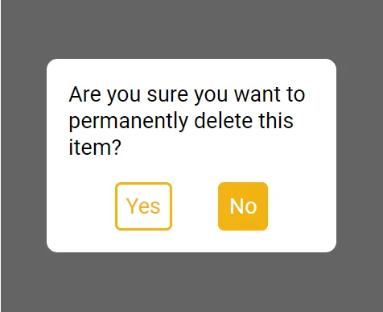

# DeleteDialog

The DeleteDialog component is a modal dialog that prompts the user to confirm a deletion operation. It provides a message and two buttons: "Yes" and "No". Clicking "Yes" triggers the deletion operation, while "No" simply closes the dialog.

## 1. Import DeleteDialog

First, you need to import the **DeleteDialog** component from Miwi.

```ts
import { DeleteDialog } from "miwi";
```

## 2. Use DeleteDialog

You can use the DeleteDialog component in your JSX code. Here's an example:

```ts
<DeleteDialog
  message={"Are you sure you want to permanently delete this item?"}
  onDelete={props.onYes}
/>

```



In this example, when the "Yes" button is clicked, the message "Deleted!" will be logged to the console.

Here's another example where the deletion operation is a function that removes an item from an array:

```ts
const items = ["Item 1", "Item 2", "Item 3"];
const deleteItem = (index: number) => {
  items.splice(index, 1);
};

<DeleteDialog
  onDelete={() => deleteItem(1)}
  message="Are you sure you want to permanently delete "this - item"?
/>;
```

In this example, when the "Yes" button is clicked, the item at index 1 will be removed from the items array.

## DeleteDialog default props:

The DeleteDialog component accepts all the props of the Box component, as well as an onDelete callback function and a message string.
