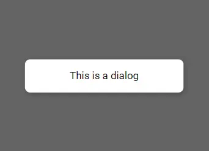
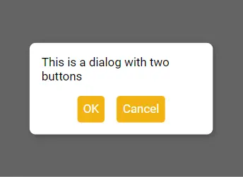

# Dialog

The Dialog component in Miwi is a modal-like feature that displays content in a layer above the main application. It is useful for interactions that require user attention, such as accepting input, confirming actions, or presenting additional information. When the Dialog component is active, it renders over the screen content, graying out the background to draw the user's attention. Additionally, if the user clicks outside the Dialog component, it will close automatically.

## 1. Import Dialog

First, you need to import the **Dialog** component from Miwi.

```ts
import { Dialog } from "miwi";
```

## 2. Use Dialog

In this example, the Dialog component is used to display a simple message. The message is wrapped in a &lt;Txt&gt; tag and passed as a child to the Dialog component.

```ts
<Dialog>
  <Txt>This is a dialog</Txt>
</Dialog>
```



Here's another example of how to use the Dialog component. In this example we have a Dialog with two buttons in a &lt;Row&gt; component for alignment, "Ok" and "Cancel"

```ts
<Dialog doNotCloseOnClickOutside={true}>
  <Txt>This is a dialog with two buttons</Txt>
  <Row>
    <Button onClick={okFunction}>OK</Button>
    <Button onClick={cancelFunction}>Cancel</Button>
  </Row>
</Dialog>
```



In this example, the doNotCloseOnClickOutside prop is set to true to prevent the dialog from closing when the user clicks outside of it. The dialog contains a message and two buttons for confirming or canceling the action.

## Default props:

The Dialog component accepts all the props that the Box component does, as it is essentially a styled Box. Here are the default props for the Dialog component:

```ts
{
  doNotCloseOnClickOutside: false;
} & BoxProps,
```

The doNotCloseOnClickOutside prop determines whether the dialog should close when the user clicks outside of it. By default, it is set to false, which means the dialog will close when the user clicks outside of it.
