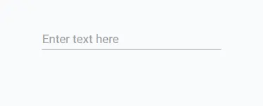
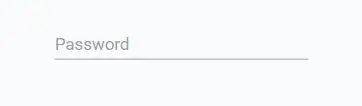
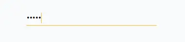

# Field

The Field component is a versatile input field component that can be used to capture various types of user input. It supports different keyboard types, input formats, and has built-in validation capabilities. It also supports customization of appearance through props.

## 1. Import Field

First, you need to import the **Field** component from Miwi.

```ts
import { Field } from "miwi";
```

## 2. Use Field

Here's an example of how to use the Field component with some of its props. In this example, the Field component is used as a text input field. The hintText prop is used to display placeholder text in the field.

```ts
<Field
  value={yourVariable}
  hintText="Enter text here"
  inputType="text"
  enterKeyHint="enter"
  underlined={true}
/>
```



Note:
The value prop will sore the user's input.

<br>

Here is another example. In this example, the Field component is utilized as a password input field. As the user types, each character is concealed to ensure privacy and security.

```ts
<Field 
  value={yourVariable} 
  hintText="Password" 
  inputType="password" 
  underlined
/>
```
The code above renders like this:



When user starts editing Field renders like this:



## Default props:

```ts
{
    value?: Prop<string>;
    tempValue?: Prop<string>;
    hasFocus?: Prop<boolean>;
    hintText?: string;
    hintColor?: string;
    lineCount?: number;
    limitLines?: boolean;
    underlined?: boolean;
    scale?: number;
    iconPath?: string;
    keyboard?: KeyboardType;
    h1?: boolean;
    h2?: boolean;
    capitalize?: FieldCapitalization;
    inputType?: `password` | `text` | `email` | `number` | `tel` | `url`;
    onBlur?: () => void;
    validateNextInput?: (nextInput: string) => boolean;
    formatInput?: FormatFieldInput;
    enterKeyHint?: `enter` | `done` | `go` | `next` | `previous` | `search` | `send`;
  } & BoxProps,
```


<!-- How to add a picture -->
<!--  -->

<!-- How to add <> in your text. -->
<!-- lt;component&gt; -->
